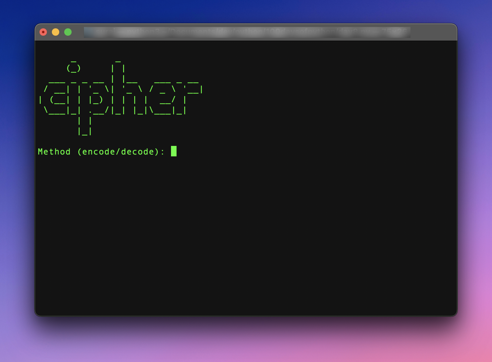
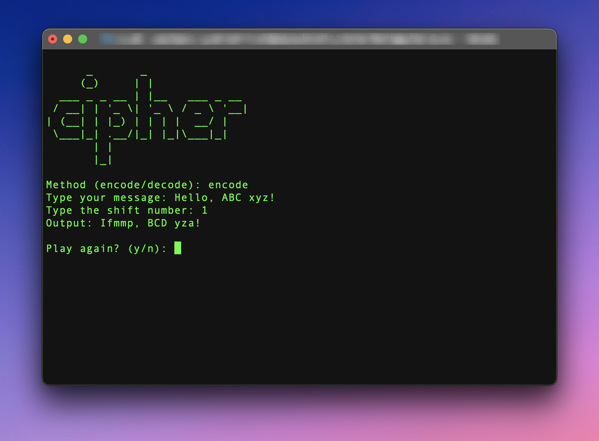
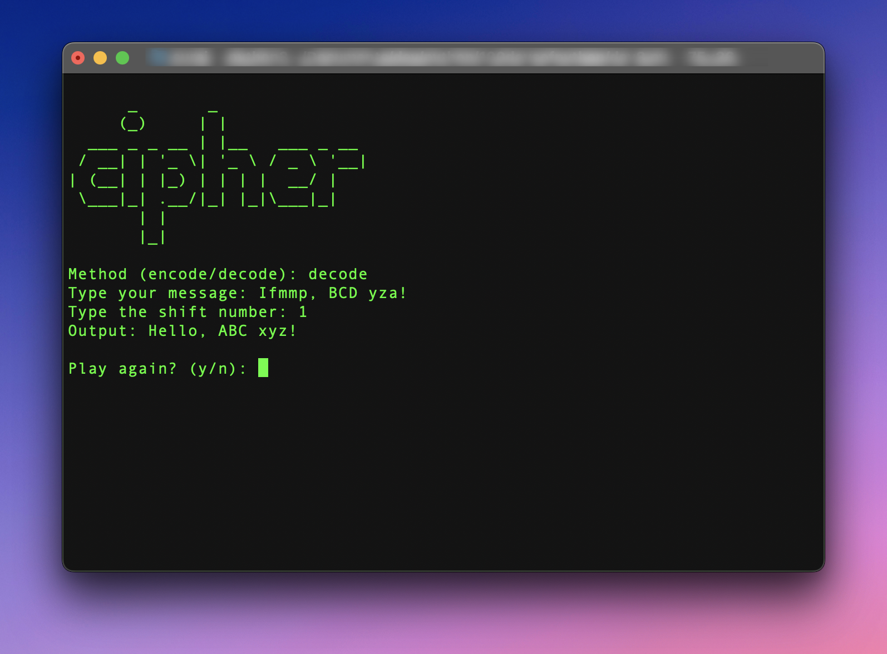

# Caesar Cipher

Caesar Cipher with ASCII art

A basic encryption and decryption program built with Python.

The program first asks the user if s/he wants to encode or decode a message. Then the program asks for the message, and shifts the message according to the "shift value" provided by the user. As in if the shift value is 1, "a" becomes "b" and so on.

The decryption works in a similar manner, but the opposite. It shifts back the message as per the shift key provided by the user. This is better than not having any encryption because both the sender and receiveer of the message need to have the same key in order to make sense of the message.

